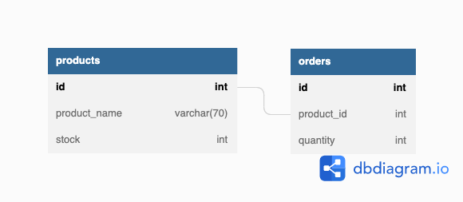

# Lab 3: SQL Transactions

In this lab we will go side-by-side into executing a transactions example, for that we will create an inventory management
table for a store that sells clothing. 


### Prerequisites
* [Install docker](https://docs.docker.com/engine/install/) 
* Install a db client (i.e. [DBeaver](https://dbeaver.io/download/)) 
* Install docker compose (only if you are on Linux)

### What You Will Learn


## Let's get started

The store has two tables `products` and `orders` under their database which is called `old_navy`.



For simplicity I have defined the tables that you will need to create, you will also have to create the `old_navy` database:

```
CREATE TABLE products (
  id int unsigned NOT NULL AUTO_INCREMENT,
  product_name varchar(70) DEFAULT NULL,
  stock int unsigned DEFAULT NULL,
  PRIMARY KEY (id)
);

CREATE TABLE orders (
  id int unsigned NOT NULL AUTO_INCREMENT,
  product_id int unsigned NOT NULL,
  quantity int unsigned DEFAULT NULL,
  PRIMARY KEY (id),
  FOREIGN KEY (product_id) REFERENCES products (id)
);
```

Now that the tables are created,  let's insert 5 Jeans in stock into the `products` table:

```
INSERT INTO products VALUES (NULL, "Jeans", 5);
```

Some time later, you get an order for the Jeans with a quantity of 10, which will be inserted into the `orders` table: 

```
INSERT INTO orders VALUES (NULL, 1, 10);
```

After saving the order to the `orders` table, you will need to update the **stock** column from the `products` table for  
the ordered jeans: 

```
UPDATE products SET stock = stock - 10 WHERE id = 1;
```

But, since we only had 5 pieces of Jeans in **stock**, MySQL will throw an error saying that the column value is 
out of range: 

```
SQL Error [1690] [22001]: Data truncation: BIGINT UNSIGNED value is out of range in '(`old_navy`.`products`.`stock` - 10)'
```

Now we will have to cancel the order since we don't have enough stock for the Jeans, so let's remove it from the database: 

```
DELETE FROM orders WHERE id = 1;
```

We canceled the order, but we had to run a few extra commands because we save the new order into the `orders` table before 
the transaction was validated. 

This case is exactly where a transaction can help you...

## Rolling back changes

Multiple SQL statements executed within a transaction won't be permanently saved to the database until you run 
a `COMMIT` statement. 

To start a transaction, you need to run the `START TRANSACTION` statement first: 

```
START TRANSACTION; 
```

Now every single statement that you run after that command won't be saved permanently to the database, to test it out
let's insert another record to the `orders` table as follows: 

```
START TRANSACTION;
INSERT INTO orders VALUES (NULL, 1, 8);
UPDATE products SET stock = stock - 8 WHERE id = 1;
```

The `UPDATE` statement above still fails because you don’t have 8 pieces of Jeans in stock:

```
SQL Error [1690] [22001]: Data truncation: BIGINT UNSIGNED value is out of range in '(`old_navy`.`products`.`stock` - 8)'
```

If you query the `orders` table, you will have a new order record for the 8 pieces of Jeans: 

```
mysql> SELECT * FROM orders;
+----+------------+----------+
| id | product_id | quantity |
+----+------------+----------+
|  1 |          1 |       10 |
|  2 |          1 |        8 |
+----+------------+----------+

```

Instead of running a `DELETE` statement, since we are already within a transaction, we can simply `ROLLBACK` the insertion: 

```
ROLLBACK; 
```

That order should no longer be within the `orders` table. 


## Committing transaction changes

Let's think about another scenario, a few days later a third order comes in for 4 pieces of Jeans, this time you will try
to run the insert and update statements under a transaction again: 

```
START TRANSACTION;
INSERT INTO orders VALUES (NULL, 1, 3);
UPDATE products SET stock = stock - 3 WHERE id = 1;
```

This time the `UPDATE` statement did work because you still had 5 pieces of Jeans at the time of the order. 

Now you can save the changes permanently to the database using the `COMMIT` statement: 

```
COMMIT; 
```

Both changes to the `products` and `orders` table are now saved permanently. 


### Why are transactions useful? 

Imagine you have many SQL statements that make changes to multiple related tables, let's say you have 10 
related SQL statements, and whenever you are executing them the 9th statement fails and you need to undo any change made
by the previous 8 statements **manually**.

Using a transaction feature will save you from manually doing it, you can leverage the `ROLLBACK` and `COMMIT` statements to 
either undo or save all related changes at once. 