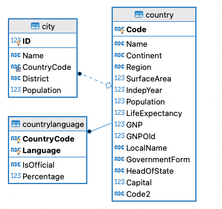

# Lab 4: SQL Clauses [Joins, Group by & Union]

### Prerequisites
* [Install docker](https://docs.docker.com/engine/install/) 
* Install a db client (i.e. [DBeaver](https://dbeaver.io/download/)) 
* Install docker compose (only if you are on Linux)

### What You Will Learn
- Joins (Inner, Left, Right, etc)


# Let's get started
For this lab we will use mysql's `world` sample database, in this folder there's a `docker-compose.yml` file 
and a `world.sql` file, when doing a `docker-compose up -d` it will automatically load the `world.sql` data. 



## Designing a query 

Figure out how to write your SQL queries, the following questions will help you out: 

* Which tables contain the critical data? `(FROM)`
* Which columns do I need in the result set? `(SELECT)`
* Are there any tables that should be connected? If so, how are they connected `(JOIN and/or WHERE)`?
* Do I need to filter any values `(WHERE)`?
* Do I need to return only `DISTINCT` records?
* Do I care about the order of records returned? If so, which columns do I need to sort by and in what precedence?

# Exercises

## Exercise 1
List the full names of all countries where English is spoken as an official language. Do this as a single query.

Expected results: 
```commandline
+--------------------------------------+
| name                                 |
+--------------------------------------+
| Anguilla                             |
| American Samoa                       |
| Antigua and Barbuda                  |
| Australia                            |
| Belize                               |
| Bermuda                              |
| Barbados                             |
| Canada                               |
| Cocos (Keeling) Islands              |
...
+--------------------------------------+
44 rows in set (0.00 sec)
```

> NOTE: Use an inner join
 
## Exercise 2

Find the list of the countries that do not have any language information in the `countrylanguage` table. 

> NOTE: Use a left join 

Expected results: 
```commandline
+----------------------------------------------+
| name                                         |
+----------------------------------------------+
| Antarctica                                   |
| French Southern territories                  |
| Bouvet Island                                |
| Heard Island and McDonald Islands            |
| British Indian Ocean Territory               |
| South Georgia and the South Sandwich Islands |
+----------------------------------------------+
6 rows in set (0.00 sec)
```


## Exercise 3

Find the name of the countries that do not have information of any city in the `city` table.

> NOTE: Use a right join 

Expected result: 

```commandline
+----------------------------------------------+
| Name                                         |
+----------------------------------------------+
| Antarctica                                   |
| French Southern territories                  |
| Bouvet Island                                |
| Heard Island and McDonald Islands            |
| British Indian Ocean Territory               |
| South Georgia and the South Sandwich Islands |
| United States Minor Outlying Islands         |
+----------------------------------------------+
7 rows in set (0.01 sec)
```

## Exercise 4
