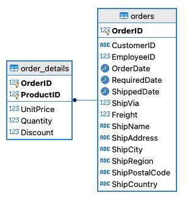
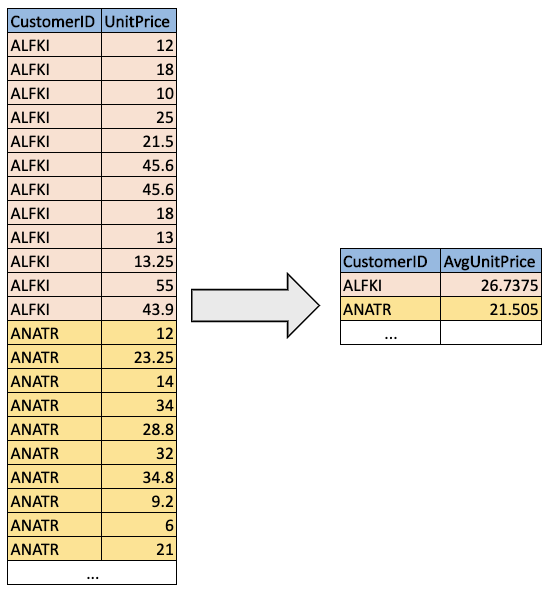
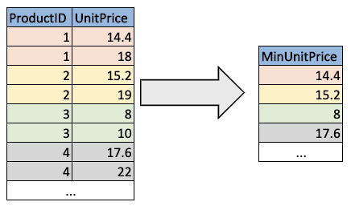
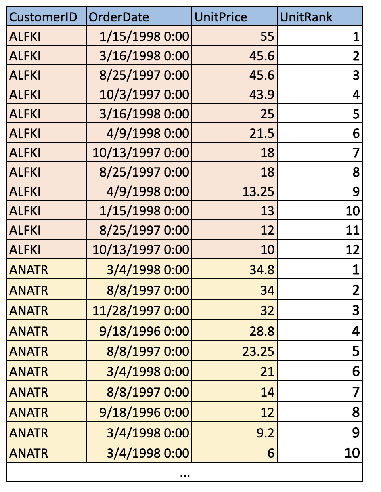
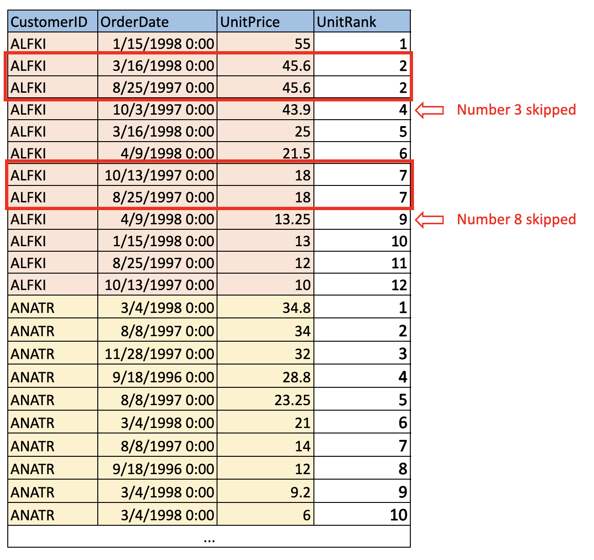
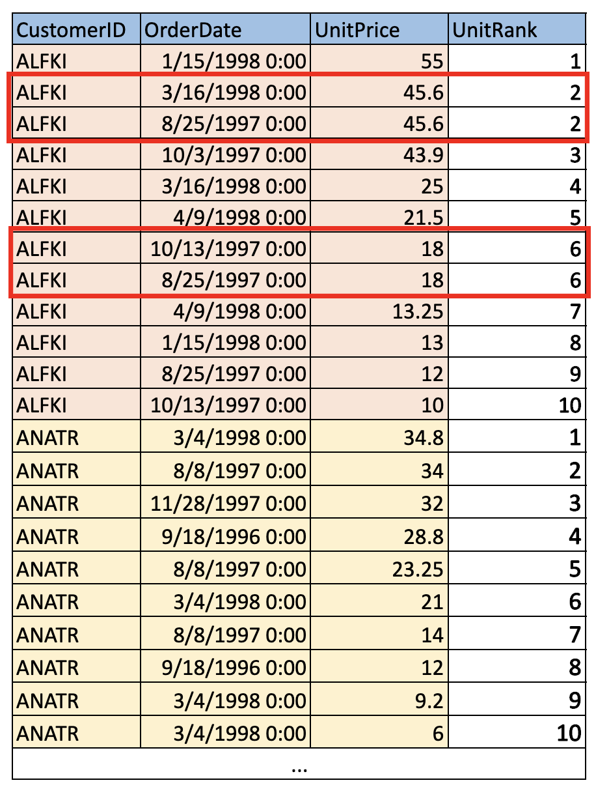
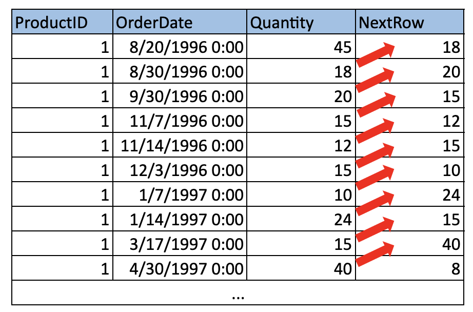

# Lab 5: Window Functions

In this lab we will put to practice different types of Window Functions. 

We will be using the tables **orders** and **order_details** from the Northwind sample database adapted for MySQL. 




### Prerequisites
* [Install docker](https://docs.docker.com/engine/install/) 
* Install a db client (i.e. [DBeaver](https://dbeaver.io/download/)) 
* Install docker compose (only if you are on Linux)

### What You Will Practice
- Window functions

## Window functions syntax

The following is the generic syntax for a window function: 

```
SELECT <column1>,
       <column2>, 
       <window_function>(expression) OVER (PARTITION BY <partition_list> ORDER BY <order_lits> ROWS frame_clause)
FROM <table_name>
```

* **window_function** is the name of the window function we want to use (sum, avg, row_number, etc...)
* **expression** is the name of the column that we want the window function to operate on; it may not be necessary depending on the **window_function** to use. 
* **OVER** this word means that is a window function
* **PARTITION BY** divides the rows into partitions, so we can specify which rows to use to compute the window function
* **partition_list** is the name of the column(s) we want to partition by
* **ORDER BY** is used to order the rows within each partition (optional).
* **order_list** is the name of the column(s) we want to order by
* **ROWS** can be used if we want to further limit the rows within our partition (optional).
* **frame_clause** defines how much offset from our current row we want our window size. 

## Window functions types 
The window functions are divided into three types value window functions, aggregation window functions, ranking window functions and value window functions:


* **Aggregate functions**: we can use these functions to calculate various aggregations such as average, total # of rows, maximum or minimum values, or total sum within each window or partition.
* **Ranking functions**: these functions are useful for ranking rows within each partition.
* **Value functions**: these functions allow you to compare values from previous or following rows within the partition or the first or last value within the partition.


# Let's get started

## Aggregate functions exercises

### Exercise 1

Create a column to calculate the average **Unit Price** for each existing customer.

Expected results: 


### Exercise 2
Create a new column that calculates the minimum **Unit Price** for each product id.

Expected results: 


### Exercise 3
Create a new column that calculates the average **Unit Price** for each group of **CustomerID** and **EmployeeID**.

Expected results: 


## Ranking functions exercises

### Exercise 4
Create a new column that ranks the Unit Price of products in descending order for each CustomerID using `ROW_NUMBER()`

Expected results: 



### Exercise 5: 
Create a new column that ranks the Unit Price of products in descending order for each CustomerID using `RANK()`

Expected results: 


### Exercise 6: 
Create a new column that ranks the Unit Price of products in descending order for each CustomerID using `DENSE_RANK()` 

Expected results: 



## Value functions exercises

### Exercise 7: 
Create a new column that provides the previous order date's quantity for each ProductID. 

Expected results: 


### Exercise 8:

Create a new column that provides the following order date's quantity for each ProductID. 
 
Expected results: 

