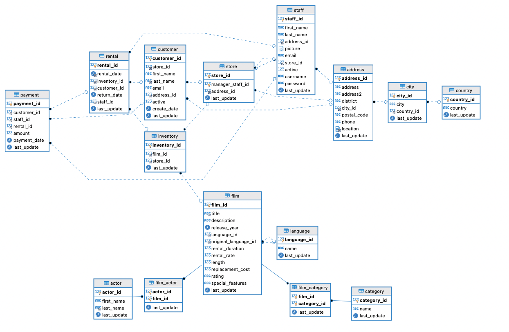

# Lab 6: Stored Procedures



### Prerequisites
* [Install docker](https://docs.docker.com/engine/install/) 
* Install a db client (i.e. [DBeaver](https://dbeaver.io/download/)) 
* Install docker compose (only if you are on Linux)

### What You Will Practice
- Stored Procedures

# Exercises

## Exercise 1
The following query tells us the **first name**, **last name** and **email** of 
all the customers who rented `Action` movies. 

Convert the query into a simple stored procedure. 
````
SELECT first_name, last_name, email
FROM customer
JOIN rental ON customer.customer_id = rental.customer_id
JOIN inventory ON rental.inventory_id = inventory.inventory_id
JOIN film ON film.film_id = inventory.film_id
JOIN film_category ON film_category.film_id = film.film_id
JOIN category ON category.category_id = film_category.category_id
WHERE category.name = "Action"
GROUP BY first_name, last_name, email;
````

## Exercise 2
Let's make our previous stored procedure more dynamic, update it in such a way that it can take 
a string argument for the category name and return the results for all customers that rented movies from
such category. 

Category examples: 
* Family
* Animation
* Children
* Classics
* Comedy
* Drama


## Exercise 3
Write a query to check the number of movies released in each category. Turn this query into a stored procedure
and filter out categories that do not pass a certain value, pass this number as an argument into the stored procedure. 

