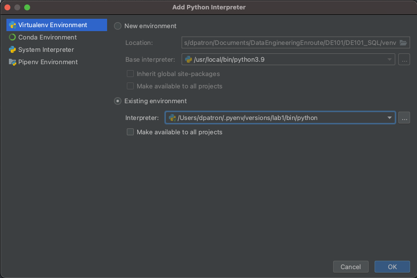
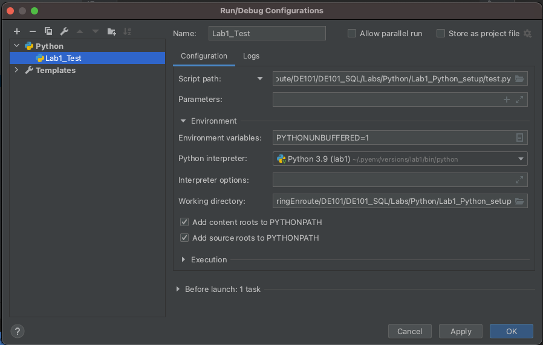

# Python Lab1: Environment Setup 

# Virtual environments

Python virtual environments create isolated contexts to keep dependencies required by different projects separate so 
they don't interfere with other projects or system-wide packages. 
Basically, setting up virtual environments is the best way to isolate different Python projects, especially if these 
projects have different and conflicting dependencies.

> Tip: Always set up a separate virtual environment for each Python project, and install all the required dependencies 
> inside it, never install packages globally.

## Install pyenv

* Window: https://github.com/pyenv-win/pyenv-win
* Mac/Linux: https://realpython.com/intro-to-pyenv/

## Creating the virtual environment

To create a virtual environment use the following command:

* `<python_version>` is optional, but it is useful to make sure you are creating the virtual environment with the version that you want
* `<environment_name>` is just the name of the environment that will help you keep your environments separate

```
$ pyenv virtualenv <python_version> <environment_name>
```

Example: 

```
$ pyenv virtualenv 3.9.0 lab1
```

## Activate the virtual environment

Now that the environment is created, you need to activate it:  

```
$ pyenv local lab1
```

> Tip: When the virtual environment is activated you can see the name at the beginning of the command line
> i.e. (lab1) ~/DE101_SQL/Labs/Python/Lab1_Python_setup 


## ✏️ Exercise

Install python version 3.7 and create a virtual environment with that version.


# IDE integration

## Pycharm 

In this folder there is a python script [test.py](test.py), we will setup our environment with Pycharm so we can run it
directly from there. 

Download [Pycharm](https://www.jetbrains.com/es-es/pycharm/) Community edition. 

## Setting up the interpreter  
A virtual environment consist of a base interpreter and installed packages, now we have to add the python interpreter 
that we setup in previous steps in Pycharm in order to run our `test.py` file with it.

Go to **PyCharm** > **Preferences** > **Python Interpreter** > **Add**:


Select the **Existing environment** and look for the `lab1` virtual environment: 



## Add Configuration 

In order to run our script we need to add a configuration, go to the top right corner to **Add Configuration...** > **+** > **Python**: 


Fill the information for the script path, working directory and make sure you are using the python interpreter that we just 
set up in the previous step:  



Save your changes and now execute the script using the green arrow on the top right corner:


Example output: 

```
/Users/dpatron/.pyenv/versions/lab1/bin/python /Users/dpatron/Documents/DataEngineeringEnroute/DE101/DE101_SQL/Labs/Python/Lab1_Python_setup/test.py
Hello World from python version 3.9.0 (default, Oct  6 2022, 00:08:15) 
[Clang 12.0.5 (clang-1205.0.22.11)]

Process finished with exit code 0
```